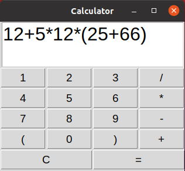

# Simple GUI Calculator

### 10.12.2023  
  
I'm continuing testing tkinter. This time I wrote simple code for GUI Calculator. Check it out

## How it looks like:

## Functionalities:  

This calculator can perform simple calculations such as addition, subtraction, multiplication and division.